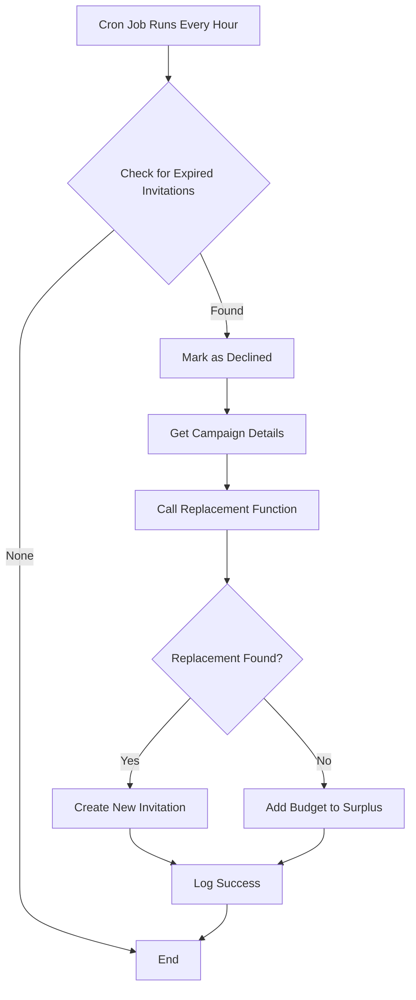

# Automatic Invitation Expiration Feature

## Overview

This feature automatically handles invitations that influencers don't respond to within 48 hours. When an invitation expires, the system:

1. ✅ Marks the invitation as declined
2. 🔄 Automatically finds a replacement influencer
3. 📧 Sends a new invitation to the replacement
4. 💰 Manages budget adjustments if needed

## User Experience

### For Campaign Owners

**Before this feature:**
- Had to manually check which influencers didn't respond
- Lost time waiting for responses that never came
- Had to manually find and invite replacements

**With this feature:**
- System automatically handles non-responsive influencers
- Campaign moves forward without manual intervention
- Always maintains the target number of influencers
- Budget is managed automatically

### For Influencers

**What they see:**
- Receive invitation with all details
- Have 48 hours to accept or decline
- After 48 hours, invitation automatically expires
- No pressure, but clear deadline

**Best practice for influencers:**
- Review invitations within 24 hours
- Accept or decline rather than ignoring
- Contact owner if need more time

## How It Works

### Timeline

```
Hour 0:  📧 Invitation sent to Influencer A
         Status: PENDING
         
Hour 24: ⏰ Still pending (no action yet)
         
Hour 47: ⏰ Still pending (1 hour left)
         
Hour 48: ⚠️  EXPIRED - Auto-processing triggered
         ├─ Invitation A → Status: DECLINED
         ├─ Search for replacement (Influencer B)
         ├─ Send invitation to Influencer B
         └─ Update campaign stats
         
Hour 48: ✅ New invitation sent
         Status: PENDING (for Influencer B)
```

### Technical Flow



## Configuration

### Expiration Time

Default: **48 hours**

To change:
1. Edit `supabase/functions/process-expired-invitations/index.ts`
2. Change the calculation in line ~30:
   ```typescript
   // Current: 48 hours
   .lt('created_at', new Date(Date.now() - 48 * 60 * 60 * 1000).toISOString())
   
   // For 24 hours:
   .lt('created_at', new Date(Date.now() - 24 * 60 * 60 * 1000).toISOString())
   ```
3. Redeploy: `supabase functions deploy process-expired-invitations`

### Check Frequency

Default: **Every hour**

This is configured in:
- GitHub Actions: `.github/workflows/process-expired-invitations.yml`
- Cron expression: `'0 * * * *'`

To change to every 30 minutes:
```yaml
schedule:
  - cron: '*/30 * * * *'
```

## Monitoring & Analytics

### View Expired Invitations

```sql
-- Last 7 days of auto-declined invitations
SELECT 
  ii.id,
  ii.created_at,
  ii.responded_at,
  c.title as campaign_title,
  ip.display_name as influencer_name,
  (ii.responded_at - ii.created_at) as time_pending
FROM influencer_invitations ii
JOIN campaigns c ON c.id = ii.campaign_id
JOIN influencer_profiles ip ON ip.id = ii.influencer_id
WHERE 
  ii.status = 'declined'
  AND ii.responded_at IS NOT NULL
  AND ii.responded_at > NOW() - INTERVAL '7 days'
  AND (ii.responded_at - ii.created_at) > INTERVAL '47 hours'
ORDER BY ii.responded_at DESC;
```

### Success Rate

```sql
-- Calculate invitation response rates
SELECT 
  COUNT(*) FILTER (WHERE status = 'accepted') as accepted,
  COUNT(*) FILTER (WHERE status = 'declined' AND responded_at - created_at < INTERVAL '48 hours') as manually_declined,
  COUNT(*) FILTER (WHERE status = 'declined' AND responded_at - created_at >= INTERVAL '47 hours') as auto_expired,
  COUNT(*) FILTER (WHERE status = 'pending') as still_pending,
  ROUND(
    100.0 * COUNT(*) FILTER (WHERE status = 'accepted') / 
    COUNT(*) FILTER (WHERE status IN ('accepted', 'declined'))
  , 2) as acceptance_rate
FROM influencer_invitations
WHERE created_at > NOW() - INTERVAL '30 days';
```

### Check Function Logs

```bash
# Real-time logs
supabase functions logs process-expired-invitations --tail

# Last 100 logs
supabase functions logs process-expired-invitations
```

## Notifications

### For Owners (Future Enhancement)

Could add notifications when:
- An invitation expires
- A replacement is found
- No replacement available

Example implementation locations:
- Email via Supabase Auth
- In-app notifications
- SMS via Twilio

### For Influencers (Current)

Influencers see:
- Original invitation in dashboard
- 48-hour window to respond
- Status updates in real-time

## Edge Cases

### What if no replacement is available?

- Budget is returned to campaign surplus
- Owner can see this in budget breakdown
- Can be used for other purposes
- Owner notified (if notifications enabled)

### What if replacement costs less?

- Difference goes to campaign surplus
- Shown in budget tracking
- Can be used to invite additional influencers

### What if replacement costs more?

- System only selects replacements within budget
- If none available, returns budget to surplus
- Never exceeds original budget allocation

### What if campaign is already complete?

- Expiration check only runs for active campaigns
- Completed/cancelled campaigns ignored
- No unnecessary processing

## Benefits

### For Campaign Efficiency

- ⚡ Faster campaign execution
- 📈 Higher fill rate of influencer slots
- 🎯 Better campaign timing
- 💪 More reliable outcomes

### For Business Operations

- 🤖 Reduced manual intervention
- ⏰ 24/7 automated processing
- 📊 Better data and analytics
- 💰 Optimal budget utilization

### For User Experience

- 🚀 Smoother campaign flow
- 😊 Less frustration from no-shows
- ✅ More predictable results
- 🔄 Automatic problem resolution

## Troubleshooting

### Invitations Not Expiring

**Check:**
1. Is the cron job running?
   ```bash
   # Check GitHub Actions runs
   gh run list --workflow=process-expired-invitations.yml
   ```

2. Are there any pending invitations?
   ```sql
   SELECT COUNT(*) 
   FROM influencer_invitations 
   WHERE status = 'pending' 
   AND created_at < NOW() - INTERVAL '48 hours';
   ```

3. Check function logs for errors

### Too Many Expirations

**Possible causes:**
- Invitations not reaching influencers
- Notification system not working
- Price points not attractive
- Content requirements too strict

**Solutions:**
- Review notification delivery
- Check spam filters
- Survey influencers for feedback
- Adjust matching criteria

## Future Enhancements

### Planned Features

1. **Dynamic Expiration Times**
   - Different times for different campaign types
   - Urgent campaigns: 24 hours
   - Standard campaigns: 48 hours
   - Flexible campaigns: 72 hours

2. **Reminder Notifications**
   - Send reminder at 24 hours
   - Send final reminder at 40 hours
   - Increase response rates

3. **Smart Scheduling**
   - Process during business hours
   - Consider time zones
   - Optimize for response patterns

4. **Analytics Dashboard**
   - Real-time expiration stats
   - Response time distribution
   - Replacement success rates
   - Budget efficiency metrics

5. **A/B Testing**
   - Test different expiration times
   - Measure impact on response rates
   - Optimize based on data

## Related Documentation

- [Setup Guide](../INVITATION_EXPIRATION_SETUP.md) - How to deploy
- [Replacement System](../AUTOMATIC_REPLACEMENT_SUMMARY_FOR_OWNER.md) - How replacements work
- [Edge Functions](../supabase/functions/README.md) - Technical details
- [Database Schema](../docs/DATABASE_SCHEMA.md) - Data structure

## Support

If you need help:
1. Check the setup guide
2. Review function logs
3. Check GitHub Actions status
4. Verify environment variables
5. Contact support team

---

**Version:** 1.0.0  
**Last Updated:** December 2024  
**Status:** Active

